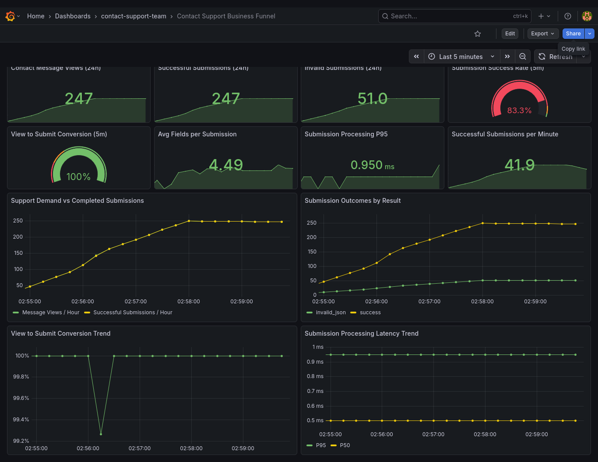
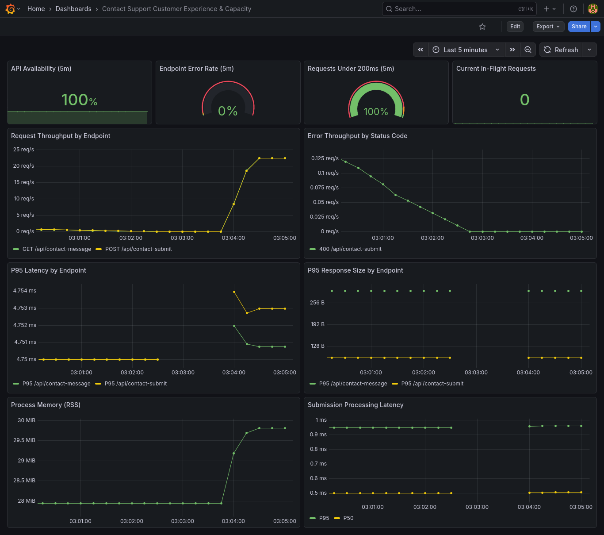
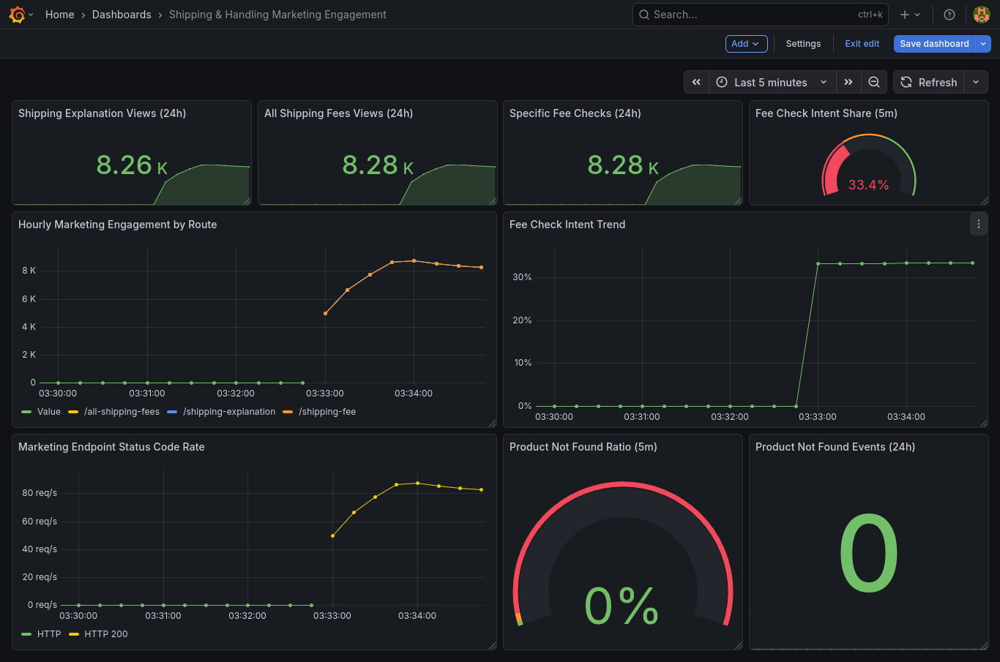
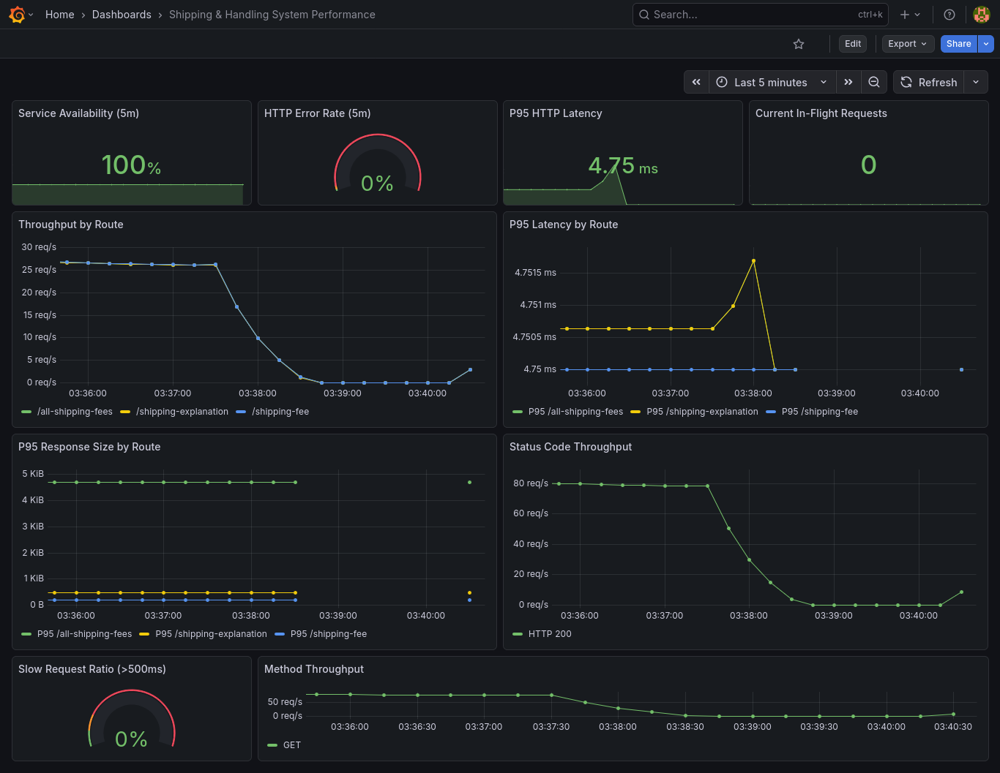

# Ecommerce Microservices Observability Platform

End-to-end portfolio project showing how I design, containerize, orchestrate, and observe a multi-service ecommerce system.

## Why This Project
I built this project as a practical way to work through a full microservices setup end to end.
The focus was to:
- containerize each service
- connect everything through Docker Compose
- add Prometheus metrics to each service
- build Grafana dashboards that are useful for both business and system monitoring

## Impact
- Built 14 Grafana dashboards across 4 service areas.
- Added 20+ business and operational metrics (conversion, auth quality, stock risk, fulfillment outcomes, latency, and errors).
- Ran 7 application services with Prometheus and Grafana in one Docker Compose setup.
- Expanded visibility from basic health checks to marketing, business, and system-level monitoring.

## Architecture
### Runtime Stack
- `ecommerce-ui` (React)
- `profile-management` (Node.js/Express)
- `product-catalog`
- `product-inventory` (Python/Flask)
- `shipping-and-handling` (Go)
- `contact-support-team` (Python/Flask)
- `order-management`
- `prometheus`
- `grafana`

### Service Ports
| Service | Port |
|---|---:|
| `ecommerce-ui` | `4000` |
| `profile-management` | `3003` |
| `product-catalog` | `3001` |
| `product-inventory` | `3002` |
| `shipping-and-handling` | `8080` |
| `contact-support-team` | `8000` |
| `order-management` | `9092 -> 9090` |
| `prometheus` | `9091 -> 9090` |
| `grafana` | `3000` |

## Observability Implementation
- Prometheus scrape config: `observability/prometheus/prometheus.yml`
- Dashboard JSON definitions:
  - `observability/grafana/dashboards/profile_management/`
  - `observability/grafana/dashboards/product_inventory/`
  - `observability/grafana/dashboards/shipping_and_handling/`
  - `observability/grafana/dashboards/contact_support_team/`

Dashboards are built to cover three layers:
- **Marketing**: user demand, intent, and funnel conversion signals
- **Business**: domain KPIs and outcome quality
- **System**: latency, error rates, throughput, saturation, and runtime health

## Dashboard Evidence

### Contact Support Team



### Shipping and Handling




### Product Inventory


### Profile Management


## Run Locally
```bash
docker compose up -d
```

Open:
- UI: `http://localhost:4000`
- Grafana: `http://localhost:3000`
- Prometheus: `http://localhost:9091`

## Skills Demonstrated
- Distributed system thinking in a local microservices setup
- Dashboard design for technical and business stakeholders
- Containerized deployment workflows and operational troubleshooting
