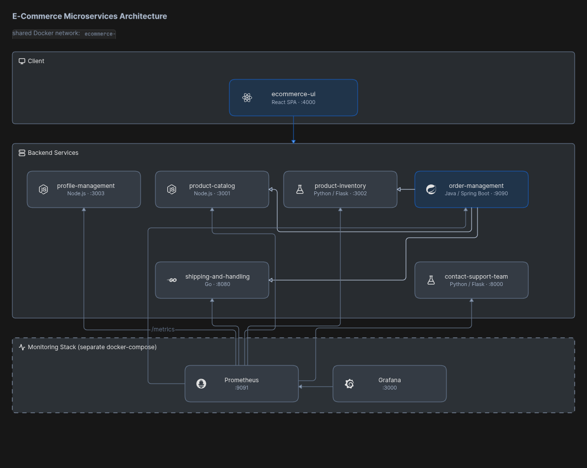
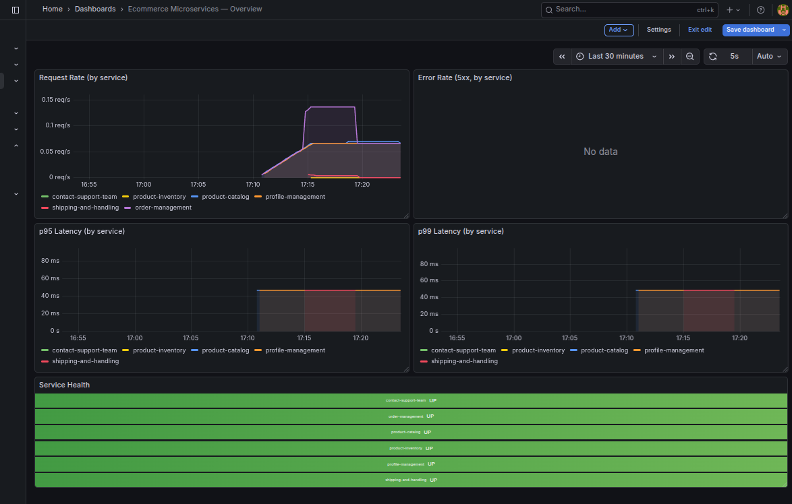

# Ecommerce Microservices

A polyglot e-commerce system built with 7 containerized services, using Docker Compose, Prometheus, and Grafana.

I started with an existing e-commerce microservices codebase that I found online and used it as a base for learning. My work here was mainly around containerizing the different services, wiring the stacks together, and adding Prometheus/Grafana monitoring. This gave me a chance to work with Node.js, Python, Go, Java, and React in the same project.

---

## What This Is

- **6 backend services**, using Node.js (Express), Python (Flask), Go, and Java (Spring Boot)
- **1 React frontend** that communicates with the backend services
- I added a **Dockerfile for each service** and containerized the different stacks separately
- I wired the existing services together using **Docker Compose**
- **Prometheus** collects request rate, error rate, and latency metrics from the backend services
- **Grafana** is used to display the metrics in a dashboard
- The application and monitoring setup use two Docker Compose files and communicate through a shared external Docker network

## Architecture



| Service | Stack | Port |
|---|---|---|
| ecommerce-ui | React | 4000 |
| profile-management | Node.js / Express | 3003 |
| product-catalog | Node.js / Express | 3001 |
| product-inventory | Python / Flask | 3002 |
| order-management | Java / Spring Boot | 9090 |
| shipping-and-handling | Go | 8080 |
| contact-support-team | Python / Flask | 8000 |
| Prometheus | — | 9091 |
| Grafana | — | 3000 |

`order-management` calls `product-inventory`, `product-catalog`, and `shipping-and-handling` when it needs to put an order together. The other services are mainly called directly by the frontend.

## Observability

After getting the existing services running, I worked on adding Prometheus monitoring to the backend services.

I added the Prometheus client/exporter library to each service's dependency list and instrumented the existing service code so it could expose metrics for Prometheus. I used the library/tooling that made sense for each language:

- **Flask** services → `prometheus-flask-exporter`
- **Node.js** services → `prom-client` with custom timing middleware
- **Go** service → `client_golang` with custom timing middleware
- **Spring Boot** service → Actuator + Micrometer's Prometheus registry

The services expose Prometheus-compatible metrics (`/metrics`, with `/actuator/prometheus` for the Spring Boot service).

Prometheus scrapes all 6 backend services every 15 seconds, and Grafana shows:

- Request rate (by service)
- Error rate — 5xx responses (by service)
- p95 latency (by service)
- p99 latency (by service)
- Service health (`up`)



## Running It

You need Docker and Docker Compose installed.

**1. Create the shared network** (one-time setup):
```bash
docker network create ecommerce-net
```

**2. Start the application stack:**
```bash
docker-compose up -d --build
```

**3. Start the monitoring stack:**
```bash
docker-compose -f docker-compose.monitoring.yaml up -d
```

**4. Access everything:**
- App: [http://localhost:4000](http://localhost:4000)
- Prometheus: [http://localhost:9091](http://localhost:9091) — check `/targets` to see if the services are `UP`
- Grafana: [http://localhost:3000](http://localhost:3000) (default login `admin`/`admin`, you'll be prompted to change it)
  - Add Prometheus as a data source: `http://prometheus:9090`
  - Import `monitoring/ecommerce-microservices-dashboard.json`

**To stop everything:**
```bash
docker-compose down
docker-compose -f docker-compose.monitoring.yaml down
```

## What's Next

There are still quite a few things I want to add to this project. The current version is more focused on getting the services, containers, and monitoring working first.

Some of the main things that are still missing are:

- **Kubernetes manifests / Helm chart** — to move the deployment from Docker Compose to Kubernetes
- **CI/CD pipeline** (GitHub Actions) — automatically build, test, and lint the project on every push
- **Container health checks** — `HEALTHCHECK` directives are currently missing from the services
- **Infrastructure as Code** (Terraform) — the current setup runs locally and is not deployed to a cloud environment yet
- **Secrets management** — the JWT secret in `profile-management` is currently hardcoded and should be moved to a proper secrets solution


## Tech Stack Summary

`Docker` · `Docker Compose` · `Node.js` · `Express` · `Python` · `Flask` · `Go` · `Java` · `Spring Boot` · `React` · `Prometheus` · `Grafana`
