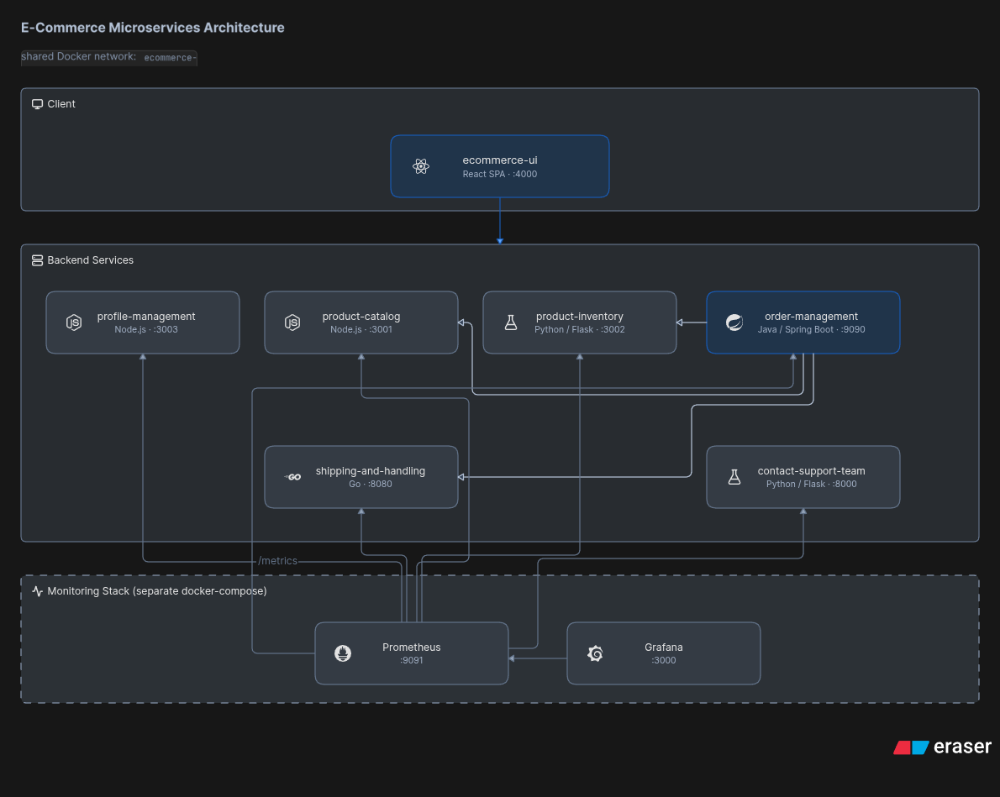

# Ecommerce Microservices

A polyglot e-commerce system built as 7 containerized microservices, orchestrated with Docker Compose, with a full Prometheus + Grafana observability stack. Brought up with a single command.

This project demonstrates practical microservices orchestration and monitoring across multiple language stacks — not a single-framework demo, but a realistic mix of the tech you'd actually find across teams in a real organization.

---

## What This Is

- **6 independent backend services**, each in a different language/framework: Node.js (Express), Python (Flask), Go, and Java (Spring Boot)
- **1 React frontend** consuming all 6 services
- **Prometheus** scraping request rate, error rate, and latency (p95/p99) from every backend service
- **Grafana** dashboard visualizing all of it in one view
- Two separate Docker Compose stacks (application + monitoring) communicating over a shared external Docker network — a deliberate separation-of-concerns pattern, not a shortcut

## Architecture



| Service | Stack | Port |
|---|---|---|
| ecommerce-ui | React | 4000 |
| profile-management | Node.js / Express | 3003 |
| product-catalog | Node.js / Express | 3001 |
| product-inventory | Python / Flask | 3002 |
| order-management | Java / Spring Boot | 9090 |
| shipping-and-handling | Go | 8080 |
| contact-support-team | Python / Flask | 8000 |
| Prometheus | — | 9091 |
| Grafana | — | 3000 |

`order-management` calls `product-inventory`, `product-catalog`, and `shipping-and-handling` directly to assemble orders — the only service-to-service dependency in the system. Everything else is called independently by the frontend.

## Observability

Every backend service exposes a Prometheus-compatible `/metrics` endpoint (`/actuator/prometheus` for the Spring Boot service), instrumented using the idiomatic tooling for its stack:

- **Flask** services → `prometheus-flask-exporter`
- **Node.js** services → `prom-client` with custom timing middleware
- **Go** service → `client_golang` with custom timing middleware
- **Spring Boot** service → Actuator + Micrometer's Prometheus registry

Prometheus scrapes all 6 targets every 15s. Grafana visualizes:

- Request rate (by service)
- Error rate — 5xx responses (by service)
- p95 latency (by service)
- p99 latency (by service)
- Live service health (`up`)


The importable dashboard JSON is included in `monitoring/` — import it directly into Grafana rather than rebuilding panels by hand.

## Running It

Requires Docker and Docker Compose.

**1. Create the shared network** (one-time setup):
```bash
docker network create ecommerce-net
```

**2. Start the application stack:**
```bash
docker-compose up -d --build
```

**3. Start the monitoring stack:**
```bash
docker-compose -f docker-compose.monitoring.yaml up -d
```

**4. Access everything:**
- App: [http://localhost:4000](http://localhost:4000)
- Prometheus: [http://localhost:9091](http://localhost:9091) — check `/targets` to confirm all 6 services show `UP`
- Grafana: [http://localhost:3000](http://localhost:3000) (default login `admin`/`admin`, you'll be prompted to change it)
  - Add Prometheus as a data source: `http://prometheus:9090`
  - Import `monitoring/ecommerce-microservices-dashboard.json`

**To stop everything:**
```bash
docker-compose down
docker-compose -f docker-compose.monitoring.yaml down
```

## What's Next

This is a working v1, deliberately scoped to ship rather than gold-plated. Known gaps I'm tackling in later milestones, roughly in priority order:

- **Kubernetes manifests / Helm chart** — move this off docker-compose for a proper orchestration story
- **CI/CD pipeline** (GitHub Actions) — build, test, and lint on every push
- **Container health checks** — `HEALTHCHECK` directives are currently missing across all services
- **Infrastructure as Code** (Terraform) — deploy this to an actual cloud environment instead of local-only
- **Secrets management** — a hardcoded JWT secret currently lives in `profile-management`; needs externalizing before this touches anything real


## Tech Stack Summary

`Docker` · `Docker Compose` · `Node.js` · `Express` · `Python` · `Flask` · `Go` · `Java` · `Spring Boot` · `React` · `Prometheus` · `Grafana`